# Azure DevOps connector for Service Desk Plus MSP deployment and configuration guide
This guide is based on version **1.0.1** of  Azure DevOps Connector for **ServiceDesk Plus MSP**.
- [Azure DevOps connector for Service Desk Plus MSP deployment and configuration guide](#azure-devops-connector-for-service-desk-plus-msp-deployment-and-configuration-guide)
  - [Before you begin](#before-you-begin)
  - [Deploy from Azure Marketplace](#deploy-from-azure-marketplace)
  - [Configuration of Azure DevOps connector](#configuration-of-azure-devops-connector)
    - [Installation](#installation)
    - [Settings](#settings)
  - [Delegation](#delegation)
    - [Supported sync Scenarios](#supported-sync-scenarios)
      - [Azure DevOps  to SDP sync](#azure-devops--to-sdp-sync)
      - [SDP to Azure DevOps sync](#sdp-to-azure-devops-sync)
  - [Remove Azure DevOps connector](#remove-azure-devops-connector)
  - [Upgrade Azure DevOps connector](#upgrade-azure-devops-connector)
  - [Troubleshooting](#troubleshooting)
  - [Azure DevOps project  configuration](#azure-devops-project--configuration)
  - [Service Desk Plus MSP configuration](#service-desk-plus-msp-configuration)
    - [Add "Delegated" status](#add-delegated-status)
    - [Additional fields for the Account](#additional-fields-for-the-account)
    - [Add  Incident Additional fields in Helpdesk Customizer](#add--incident-additional-fields-in-helpdesk-customizer)
    - [Add Additional fields to  Template](#add-additional-fields-to--template)
    - [Create Custom Triggers](#create-custom-triggers)
    - [Add Azure DevOps connector files to execute in SDP](#add-azure-devops-connector-files-to-execute-in-sdp)
## Before you begin

**Prerequisite:** 

- [Service Desk Plus MSP](https://www.manageengine.com/products/service-desk/)  **build 10530**  already installed and configured. [Follow configuration Prerequisties.](#Service-Desk-Plus-MSP-configuration)
- [Existing Project in Azure DevOps configured](#Azure DevOps project  configuration) for **Scrum process**.

## Deploy from Azure Marketplace

[Coming soon] Navigate to [Microsoft Azure Marketplace](https://azuremarketplace.microsoft.com/) and find ["Azure DevOps connector"](https://azuremarketplace.microsoft.com/en-us/marketplace/apps/) offer.

## Configuration of Azure DevOps connector 

After you have selected appropriate software plan you need to configure the deployment.

### Installation

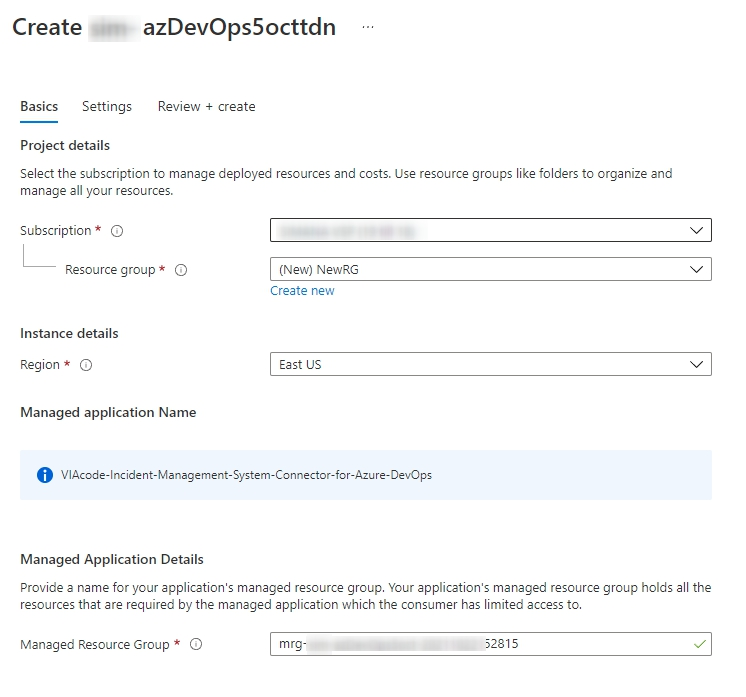

- Choose a subscription to deploy the management application.
- Create a new Resource Group.
- Select a region.
- Provide a name for your application's managed resource group. Note: you can specify name of management resource group according your naming convention.
- Press "Next : Settings >" button.

### Settings

To enable Azure DevOps Connector for Service Desk Plus you have to specify: 
- API key of the account that has administrator or SDAdmin role in the Service Desk Plus.  
  Note. All delegation related actions will be processed on behalf of this user.
- Account name that represents organization in Service Desk Plus MSP. 
Note. All letters are  case-sensitive, please use upper and lower letters  to match name of the Account in Service Desk Plus MSP. 


- Press "Next : Review + create >" button.

## Delegation

To delegate a ticket,  open it in Service Desk Plus MSP and select the "Delegate" in Custom menu. 

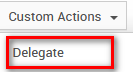

Upon successful delegation ticket status will be changed to [Delegated] in Service Desk Plus MSP.

If all parts were successfully configured, each time upon delegation a new note will be added to the SDP request, which will contain delegation details and link to PBI created in Azure DevOps board. 


### Supported sync Scenarios

#### Azure DevOps  to SDP sync

**Workitem updates sync**
In case PBI status changed or PBI updated new note will be added in SDP for the delegated ticket. 
**Workitem Status  sync**
Changing status to [Done] in Azure DevOps will lead the [Delegated] state change to [Resolved] in Service Desk Plus MSP. 
**Workitem Discussion  sync**
Discussions commented  in Azure DevOps will be synced to ServicDesk Plus MSP as notes. 

#### SDP to Azure DevOps sync

**Requesters replies sync**
In case requester who owns the request or requester with whom request has been shared click [Reply] in Service Desk Plus MSP form  and leave a comment, this comment will be synced to Azure DevOps board. ( All replies that have red envelop icon in the request will be synced.)

**Important!** 
Notes from Requester in SDP are not synced to Azure DevOps board. 
Replies or Notes from Technician in SDP are not synced to Azure DevOps board. 


## Remove Azure DevOps connector

**Step 1:** Go to Resource Group where the Managed Application installed. This resource group name **does not** start with "mrg-".

**Step 2:** Select this Application and click "Delete" button, confirm the deletion by typing "Yes" on the sidebar, then click "Delete". Deletion the Managed Application will consequently delete the second resource group with "mrg-" prefix and all of its content.

**Step 3:** (optional) If the First Resource Group is empty - only Managed Application was  stored there - you can delete this Resource Group as well.

## Upgrade Azure DevOps connector

New version of container image with increased version will automatically replace the old one.

## Troubleshooting

* Logs

  In case of any issue encountered with Azure DevOps connector, please check Azure DevOps connector logs. Logs located in the cloud management group: mrg-<id>  under section AppService - DeploymentCenter- Logs  tab. 

* Service Hooks

  To sync Azure DevOps work items with requests in Service Desk Plus MSP 2 web hooks created automatically on first delegation. Both web hooks must have "Enabled" state.   To check status of web hooks please go to the Azure DevOps Projects Settings - General - Service hooks. 

  In case sync of work items stopped working, please check the web hooks state and re-enable them. 

## Azure DevOps project  configuration

Before generating access token, [create Azure DevOps project.](https://docs.microsoft.com/en-us/azure/devops/organizations/projects/create-project?view=azure-devops&tabs=preview-page)

**Obtaining the Azure DevOps token **

Please choose "Personal access tokens" option on Azure DevOps personal setting to obtain Azure DevOps token.

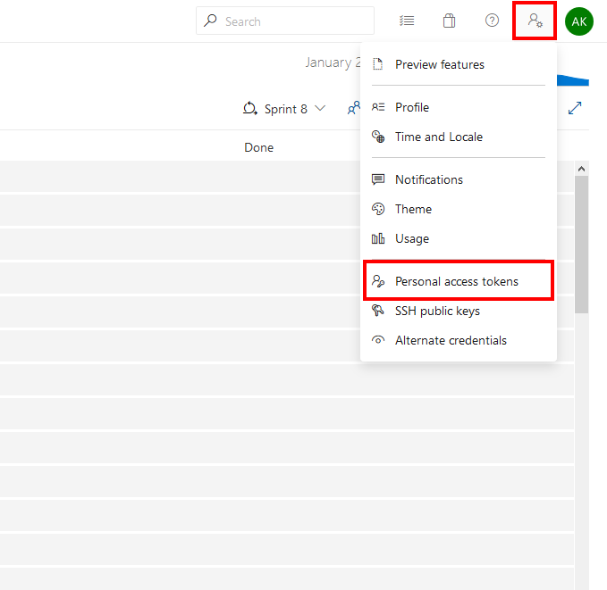

Press "New Token" button.

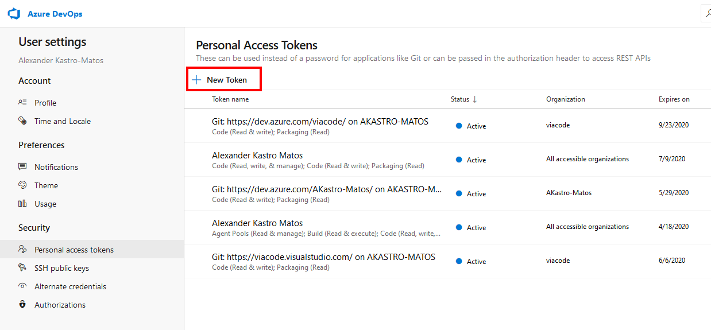

In opened dialog window please complete the following settings:

- Token name
- Token Organization
- Define token expiration date
- Grant token "Read, write, & manage" permissions with work items
Press "Create" button

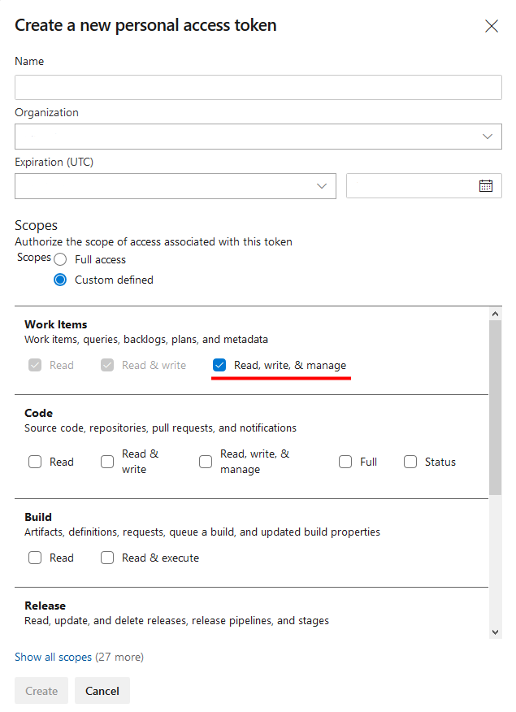

Make sure you've copied the token. **It is not stored and you will not be able to see it again.**

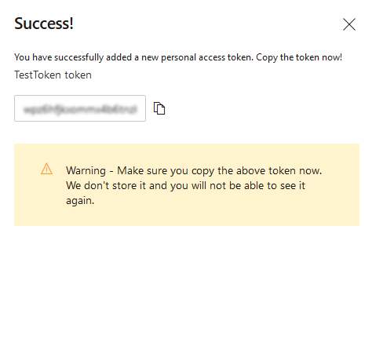

## Service Desk Plus MSP configuration

Login to Service Desk Plus MSP  with administrator credentials. 
Configure necessary fields from the "Admin" menu. 

### Add "Delegated" status

In Helpdesk Customizer- Status  create new status "Delegated". It will be used by Azure DevOps connector. 

### Create Additional fields for the Account

In Account Details - Account - Additional fields create following fields of type "Single-line":

- AzureDevOpsOrganization
- AzureDevOpsProject
- AzureDevOpsArea
- AzureDevOps Token

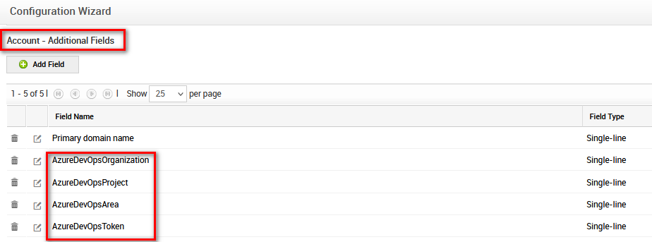

You need to fill these values  with your Azure DevOps  data for each account to make Azure DevOps connector sync data. 

### Add  Incident Additional fields in Helpdesk Customizer

Go to Helpdesk Customizer - Incident Additional fields.

Add following fields: 

- Azure DevOps Connector Data , type: Numeric
- Delegated request link, type: Single Line

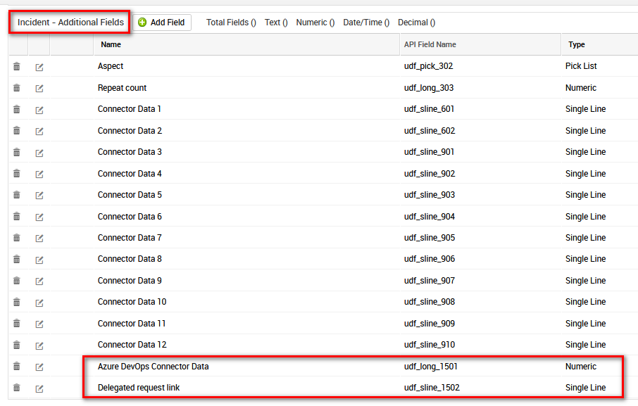

### Add Additional fields to  Template

You can add  *Azure DevOps Connector Data, Delegated request link* to Incident Template or any other template that will be used to delegate requests using Azure DevOps connector.

### Create Custom Triggers

In Helpdesk Customizer- Custom Triggers create custom trigger. 

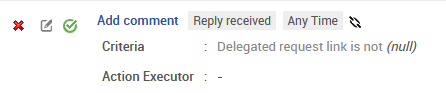

Action name: Add comment
Checked checkbox "This custom trigger is applicable for all accounts"
Execute the Action: When a new reply received - Any Time
Match the below criteria: Delegated request link - is not - null
Perform Action: Action type - Execute Script
Perform Action: Checked checkbox "Stop processing subsequent Actions"
Perform Action: Webhook Action- Add-  Template name "Add comment"

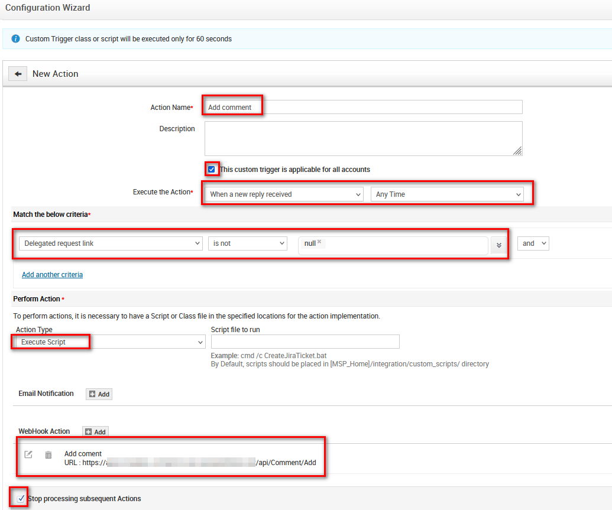

Example of  Webhook configuation: 

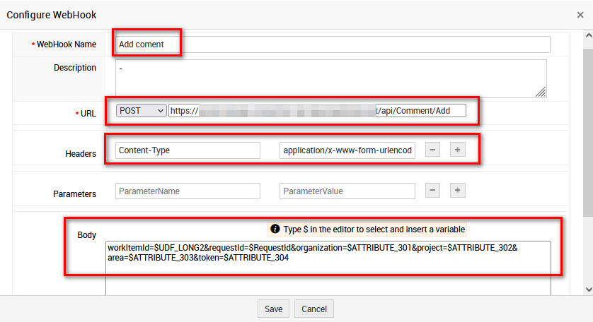

```php

URL :
POST : https://example.com/api/Comment/Add

Headers :
Content-Type:application/x-www-form-urlencoded

Parameters :

Body :
workItemId=$UDF_LONG2&requestId=$RequestId&organization=$ATTRIBUTE_301&project=$ATTRIBUTE_302&area=$ATTRIBUTE_303&token=$ATTRIBUTE_304

```

where

* example.com - domain name of website that hosts Azure DevOps connector service
* ATTRIBUTE_number1,number2, number3, number4 - variables that represent additional fields for the Account: AzureDevOpsOrganization, AzureDevOpsProject, AzureDevOpsArea, AzureDevOps Token

### Add Azure DevOps connector files to execute in SDP

Add link to Create_Azure_DevOps_work_item.html in  Request custom menu template and add special Azure DevOps  Connector files to SDP host. 
In case SDP installed on Windows server system drive default path will look as follow: c:\ManagedEngine\ServiceDeskPlus-MSP\integration\resources 

In the the path  with SDP installed do following actions: 

1. Place file Create_Azure_DevOps_work_item.html 
2. Create  folder with name "scripts"  in "resources" and place following file "Create_Azure_DevOps_Work_Item.js"
3. Create  folder with name "css" in "resources" and place following file "Create_Azure_DevOps_Work_Item.css"
