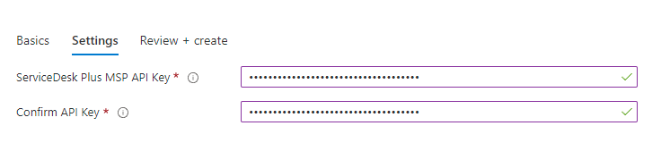

# Azure DevOps connector for Service Desk Plus MSP deployment and configuration guide
<!-- TOC -->
- [Before you begin](#before-you-begin)
- [Deploy from Azure Marketplace](#deploy-from-azure-marketplace)
  - [Plans and Pricing](#plans-and-pricing)

- [Configuration of Azure DevOps connector for VIAcode IMS](#configuration-of-azure-devops-connector-for-viacode-ims)
  - [Basics](#basics)
  - [Settings](#settings)
  - [Review and create](#review-and-create)

- [Obtaining the Azure DevOps token](#obtaining-the-azure-devops-token)
  - [Create Azure DevOps project](#create-azure-devops-project)

- [VIMS organization settings](#vims-organization-settings)

- [Additional information](#additional-information)

- [VIAcode Incident Management System for Azure with custom domain](#viacode-incident-management-system-for-azure-with-custom-domain)

<!-- TOC END -->

## Before you begin
**Prerequisite:** 

- [Service Desk Plus MSP](https://www.manageengine.com/products/service-desk/)  **build 10530** already installed and configured. [Follow configuration Prerequisties.](#Service Desk Plus MSP configuration)
- [Existing Project in Azure DevOps configured](#Azure DevOps project  configuration) for **Scrum process**

## Deploy from Azure Marketplace

[Coming soon] Navigate to [Microsoft Azure Marketplace](https://azuremarketplace.microsoft.com/) and find ["Azure DevOps connector"](https://azuremarketplace.microsoft.com/en-us/marketplace/apps/) offer.

## Configuration of Azure DevOps connector 

After you have selected appropriate software plan you need to configure the deployment.

### Basics

- Choose a subscription to deploy the management application.
- Create a new Resource Group.
- Select a region.
- Provide a name for your application's managed resource group. Note: you can specify name of management resource group according your naming convention.
- Press "Next : Settings >" button.

### Settings

To enable Azure DevOps Connector for Service Desk Plus you have to specify .

- VIMS for Azure admin login and password should be provided by Service Desk Plus MSP administrator (make sure that credentials belong to user with 'admin' role in VIMS).
After successful devops connector installation a new system user "Azure DevOps Connector" will be automatically created on VIMS. All delegation related actions will be processed on behalf of this user.

- Press "Next : Review + create >" button.

## Delegation

To delegate a ticket,  open it in Service Desk Plus MSP and select the "Delegate" in Custom menu. 

Upon successful delegation ticket status will be changed to [Delegated] in Sev

## Azure DevOps project  configuration

Before generating access token, [create Azure DevOps project.](https://docs.microsoft.com/en-us/azure/devops/organizations/projects/create-project?view=azure-devops&tabs=preview-page)

### Obtaining the Azure DevOps token  

Please choose "Personal access tokens" option on Azure DevOps personal setting to obtain Azure DevOps token.

Press "New Token" button.

In opened dialog window please complete the following settings:

- Token name
- Token Organization
- Define token expiration date
- Grant token "Read, write, & manage" permissions with work items
Press "Create" button

Make sure you've copied the token. **It is not stored and you will not be able to see it again.**

## Service Desk Plus MSP configuration

Login to Service Desk Plus MSP  with administrator credentials to configure Azure DevOps settings in the Account. 

- Click "Cogwheel" in the left bottom corner.
- Click "Organizations", edit organization.

Please complete the following "Azure DevOps" properties:

- Azure DevOps Organization (e.g. "VIACode")
- Azure DevOps Project (e.g. "TestProject")
- Azure DevOps Area (e.g. "TestProject")
- Azure DevOps Token - see [Obtaining the Azure DevOps token](#obtaining-the-azure-devops-token)
- Azure DevOps Token (confirm)

Press "Submit" button

## Additional information

If all parts was successfully configured, each time upon delegation a new article will be added to the ticket, which will contain delegation details. Moreover, on each VIMS ticket update, DevOps also will be received related notification:

In case of any issues or Azure DevOps connector unavailability new ticket will be created on VIMS side:

## VIAcode Incident Management System for Azure with custom domain

If you configure custom domain for VIAcode Incident Management System for Azure (VIMS) then you should also configure following in Azure DevOps connector for it:

- Configure custom domain for Azure DevOps connector for VIAcode IMS (Azure DevOps connector) that should be obtained from VIMS custom domain by appending "-azdevops" to top-level domain.
For example if you configured vims.viacode.com custom domain for VIMS then you should configure vims-azdevops.viacode.com custom domain for Azure DevOps connector.
- In order to have links to VIMS tickets with custom domain in Azure DevOps work items' Acceptance Criteria section you should change Vims__URL setting in Azure DevOps connector container settings to URL with VIMS custom domain.

